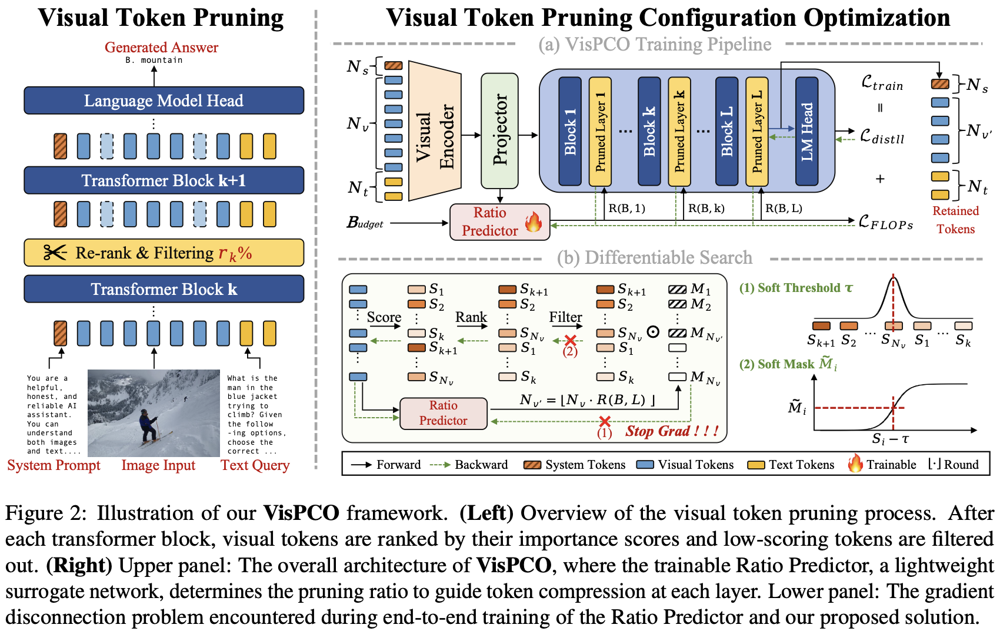
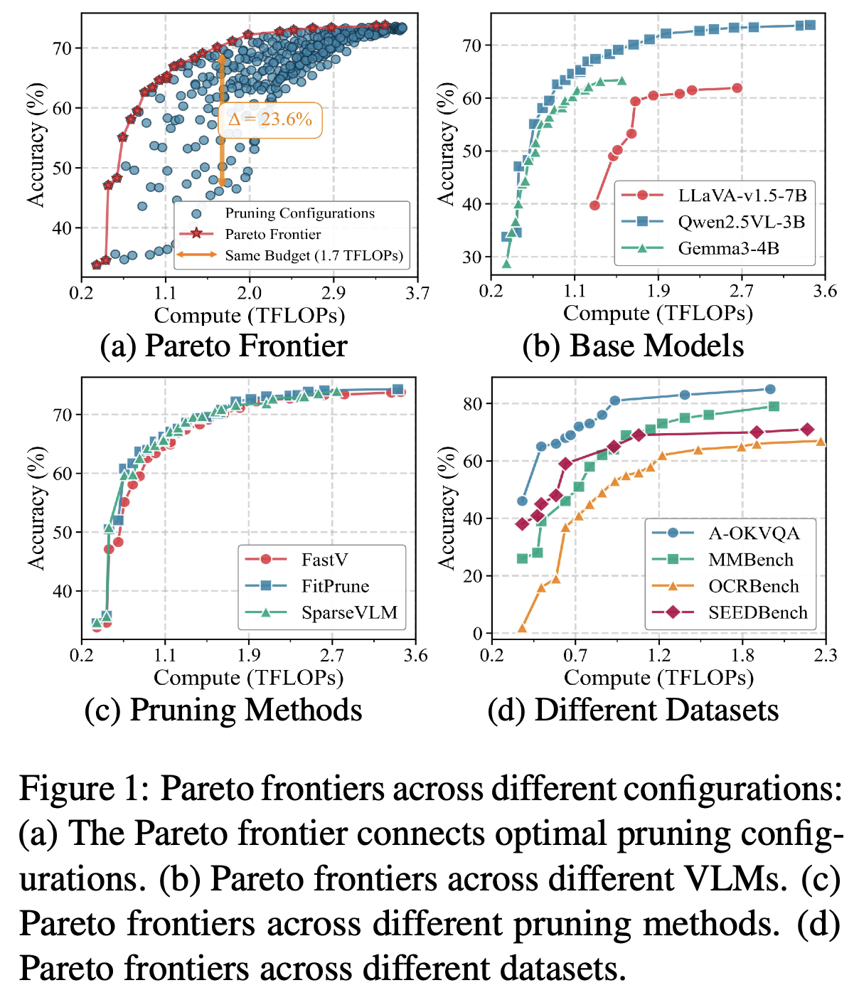

<p align='center'>

</p>

--------------------------------------------------------------------------------

**VisPCO: Visual Token Pruning Configuration Optimization via Budget-Aware Pareto-Frontier Learning for Vision-Language Models**<br>

<p align="left">
  
  
  
  
</p>


## 📜 News 
🚀 **[2026/01/15]** VisPCO code is now officially open-sourced. Welcome to explore and use it!

🔥 **[2026/01/05]** We have submitted our anonymized paper to ACL 2026! Stay tuned for more updates.

<p align='center'>

</p>

## ✒️ Contents
- [Overview](#👀-overview)
- [Preparation](#👨‍💻-preparation)
- [Preprocessing](#🛠️-preprocessing)
- [Training](#🚀-training)
- [Evaluation](#🧪-evaluation)
- [License](#license)


## 👀 Overview

Large-scale vision-language models (LVLMs) excel at cross-modal understanding, but processing high-resolution images or long videos causes a rapid increase in visual tokens and, consequently, computation costs. Visual token pruning methods aim to reduce redundant tokens, but a crucial challenge remains: **under the same computational budget, different pruning configurations can lead to vastly different model performances—sometimes differing by over 20%**. Instead of costly grid searches, **VisPCO** introduces a differentiable, Pareto-optimal approach that learns to automatically select the best pruning configuration given a computation constraint, ensuring optimal efficiency and accuracy. This enables practical and adaptive deployment, making LVLMs more efficient in real-world scenarios.

<div align=center>

</div>

## 👨‍💻 Preparation

1. Clone this repository and navigate to VisPCO folder
```bash
git clone https://github.com/xxx/VisPCO.git
cd VisPCO
```

2. Install necessary package
```Shell
conda create -n VisPCO python=3.10 -y
conda activate VisPCO
pip install -e .
```

3. Download Training Dataset

Please follow the detailed instruction in [liuhaotian/LLaVA-Instruct-150K](https://huggingface.co/datasets/liuhaotian/LLaVA-Instruct-150K).

## 🛠️ Preprocessing
Place your image-text pair JSON at `dataset/uniform_image_area.py` and update the file path accordingly. The processed images and new JSON will be saved in `output_base_dir`.

```bash 
python dataset/uniform_image_area.py --json_input_path your_downloaded_data.json --output_base_dir your_save_path
```

## 🚀 Training
Once the data is ready, you can start training.

Simply launch multi-GPU distributed training with:
```bash
bash run_gpu05.sh
```
> **Note:** By default, the `run_gpu05.sh` script uses `torchrun` to train the main model with 8 GPUs in parallel. You can modify GPU assignment or adjust training hyperparameters (such as batch size, learning rate, etc.) in the script to suit your environment.

## 🧪 Evaluation
Once the training is complete, you can evaluate the model performance.

Simply launch evaluation with:
```bash
bash eval_ours.sh
```
> **Note:** By default, VisPCO prunes tokens to use 50% of the computation budget during evaluation.  
> The detailed evaluation results will be saved in `eval_ours.txt`.


## License
This project is released under the [Apache 2.0 license](LICENSE).
